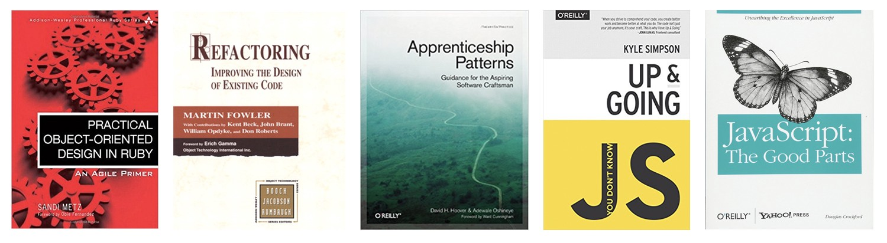

# **Side Project**

## **Project**

- **Title :** 개발자를 위한 책 정보 제공 사이트
- **Description :** 컴퓨터 공학, 개발 서적 두 개의 Category로 구성이 되며, 전체서적에 대한 검색기능도 제공합니다. (`초기 계획`)

<ins>`본 개발은 Interpark에서 제공하는 Book Open API를 사용하였습니다.`</ins>

 

## **Used Tech Stacks**

- **Front-End :** HTML5, CSS, JavaScript
- **Back-End :** -
- **Database :** -
- **Framework and Library :** ReactJS

 

## **Design Pattern**

- Container and Presenter Pattern  
  (**Container:** Data Logic, **Presenter:** View)

 

## **Project Wire frame**

<table>
  <tr>
    <td>
      
    </td>
    <td>
      
    </td>
  </tr>
  <tr>
    <td align="center"><b>Main page wireframe</b></td>
    <td align="center"><b>Detail page wireframe</b> </td>
  </tr>
</table>

 

## **Project Status**

(attach repository issue links)

 

🗓️ **2021.02.06(Sat)**  

(1) **Issue1)** Create README.md file.
→[https://github.com/LeeHyungi0622/book_recommendation_for_developer/issues/1](https://github.com/LeeHyungi0622/book_recommendation_for_developer/issues/1) 

🗓️ **2021.02.07(Sun)**  

(1) **Issue3)** Organize the fundamental folder structure of project.  
→[https://github.com/LeeHyungi0622/book_recommendation_for_developer/issues/3](https://github.com/LeeHyungi0622/book_recommendation_for_developer/issues/3)
 

(2) **Issue2,6)** Update main wireframe in README.md, Understand how to use Interpark book open API, Create api method to get thd data from open API.  
→[https://github.com/LeeHyungi0622/book_recommendation_for_developer/issues/2](https://github.com/LeeHyungi0622/book_recommendation_for_developer/issues/2)
 
→[https://github.com/LeeHyungi0622/book_recommendation_for_developer/issues/6](https://github.com/LeeHyungi0622/book_recommendation_for_developer/issues/6)
 

🗓️ **2021.02.13(Sat)**  

(1) **Issue8) Create header, router components and update app component**  
→ [https://github.com/LeeHyungi0622/book_recommendation_for_developer/issues/8](https://github.com/LeeHyungi0622/book_recommendation_for_developer/issues/8)

(2) **Issue10)** Create unit test file and write test code for issue #8 
→ [https://github.com/LeeHyungi0622/book_recommendation_for_developer/issues/10](https://github.com/LeeHyungi0622/book_recommendation_for_developer/issues/10)

 
## **Screen shots**

 

## **Installation and Setup Instruction**

 

## **Project reflection**
